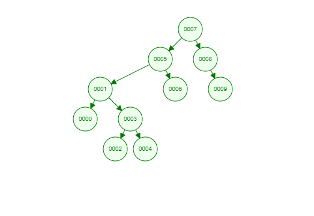

# [Patika.dev](https://app.patika.dev/paths) Data Structures and Algorithms Projects
---
## Insertion Sort Project
1. **[22,27,16,2,18,6]** -> Insertion Sort
    1. Write the stages of the array above for given sort type.
    2. Write the Big O Notation.
    3. Time Complexity: 
        - Average case: The number we are searching is in the middle. 
        - Worst case: The number we are searchging is in the start.
        - Best case: The number we are searchging is in the end.
    4. Which case will contain the number 18 after the array is sorted? Write it down.

### 1. Stages
---
1. [**22**,27,16,**2**,18,6] -> [**2**,27,16,**22**,18,6]
2. [2,**27**,16,22,18,**6**] -> [2,**6**,16,22,18,**27**]
3. [2,6,16,**22**,**18**,27] -> [2,6,16,**18**,**22**,27]

### 2. Big-O Notation:
---
O($n^2$)

### 3. Time Complexity
---
- Average Case: O($n^2$)
- Worst Case: O($n^2$) (Its factor is higher than the Average Case)
- Best Case: O(*n*)
---
2. **[7,3,5,8,2,9,4,15,6]** dizisinin Insertion Sort'a göre ilk 4 adımını yazınız.
### Stages
---
1. [**7**,3,5,8,**2**,9,4,15,6] -> [**2**,3,5,8,**7**,9,4,15,6]
2. [2,3,**5**,8,7,9,**4**,15,6] -> [2,3,**4**,8,7,9,**5**,15,6]
3. [2,3,4,**8**,7,9,**5**,15,6] -> [2,3,4,**5**,7,9,**8**,15,6]
4. [2,3,4,5,**7**,9,8,15,**6**] -> [2,3,4,5,**6**,9,8,15,**7**] 
---
## Merge Sort Project

**[16,21,11,8,12,22]** -> Merge Sort

1. Write the stages of the array above for given sort type.
2. Write the Big-O Notation

### 1.Stages
---
1.                 [16,21,11,8,12,22]

2.      [16,21,11]                     [8,12,22]   

3.      [16]  [21,11]                  [8,12]   [22]

4.      [16]  [21]  [11]               [8]  [12]  [22]

5.      [16,21]  [11]                  [8,12]  [22]

6.      [11,16,21]                     [8,12,22]
     
7.                 [8,11,12,16,21,22]
### 2. Big-O Notation:
---
O(n$logn$)

---
## Binary Search Tree Project
**[7, 5, 1, 8, 3, 6, 0, 9, 4, 2]** Write the Binary-Search-Tree stages of this array.

Example: Root is ***x***. In the root's right is ***y***. In its left is ***z*** etc.

### 1.Stages

1. Root is ***7***.
2. On the left of ***7*** is ***5***
3. On the left of ***5*** is ***1***
4. On the right of ***7*** is ***8***
5. On the right of ***1*** is ***3***
6. On the right of ***5*** is ***6***
7. On the left of ***1*** is ***0***
8. On the right of ***8*** is ***9***
9. On the right of ***3*** is ***4***
10. On the left of ***3*** is ***2***

### Binary Search Tree
---

    
<*p>