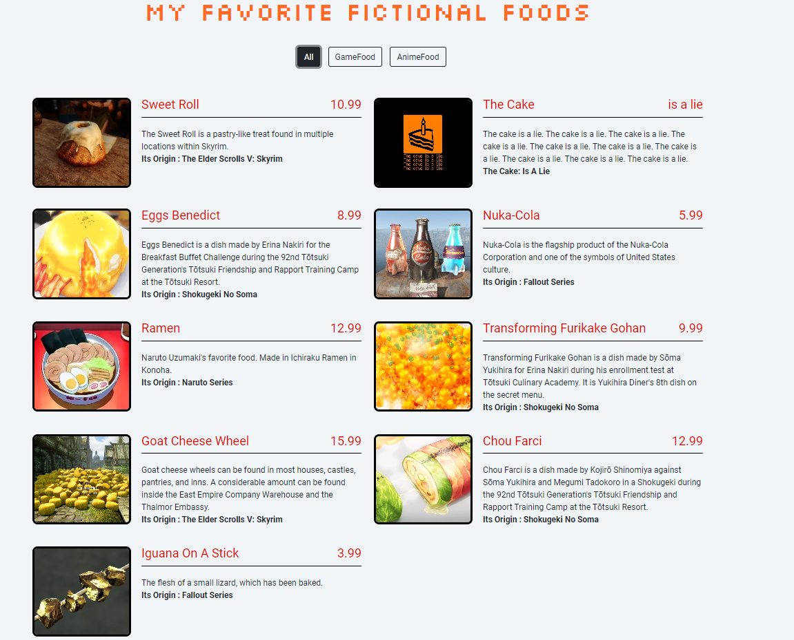
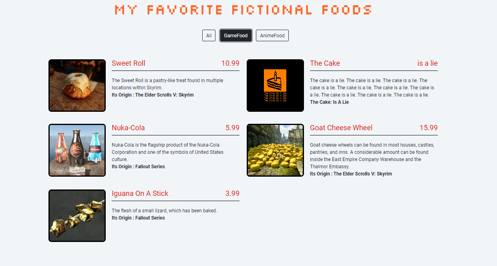
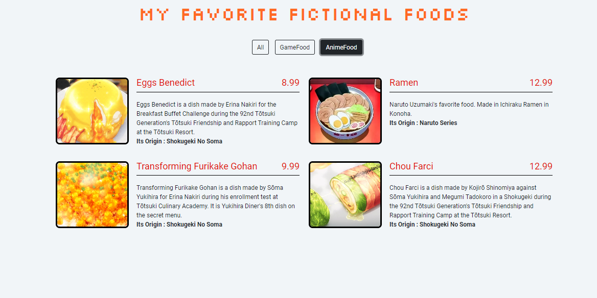

# A Menu Page
## [Patika.dev](https://app.patika.dev/paths) JavaScript Course Second Homework (Frontend Web Development Path)
---
## What is this?
We were asked to create a page that represents a menu of a kitchen using JavaScript. We were given the CSS files which contained some classes and two divs which represented the button area and menu area.

The site has a filter system that works when the user clicks a button. Buttons contains categories which in this project created by JavaScript to automatically match the categories so it can be changed. When these buttons are clicked only the foods that match with the selected categories are shown.

## What I gained?
After finishing this project I gained a meaningful experience and understanding regarded to DOM and Object with JavaScript.

---
## Screenshots

### Example Site (Asian Kitchen's Menu) by [Aycan Aleyna Yardelen](https://github.com/ayerdelen):

    

### My Site (My Favorite Fictional Foods):
#### Category : All

    

#### Category : Game Food

    

#### Category : Anime Food

    

